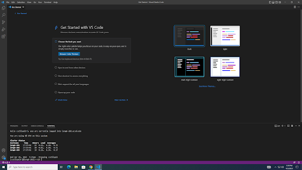

# Lab Instructions
## Installing VScode (If you already have VScode installed on your device, you can skip this step)

You will need to go to this [website](https://code.visualstudio.com/) and follow all of the instructions 
given after clicking the download link at the top right of the screen. 
You should be able to see this screen when you finish all of the steps:

# Remotely Connecting

If you have git, you do not need to install the program. Otherwise follow this [link](https://gitforwindows.org/) and
install it to your device.
Now, have VScode open and open a new terminal by using Terminal &rarr; New Terminal from the drop down menu.
Afterwards, enter this command into your terminal: 

    ssh cs15lsp23zz@ieng6.ucsd.edu 

(zz should be replaced with whatever shows up in your own username)

If the command worked correctly, your should see a message asking you if you want to continue connecting. It is fine to say **yes**.
This will cause the terminal to ask for your password which should be the password for your own account that was created earlier. 
If it all works, you should see this:

.png)

# Trying Some Commands

Once everything is up and running, you have free will on this signed in account. Here is a small list of commands that are usable:

    pwd

This command is used to print the current working directory.

    cd ~

This will send you back to the home directory.

    cd <directory>

This will send you into the specified directory.

    ls -lat

This ls command will print out all of the files found in the current working directory. When looking at the letters for "lat", l will make the command
print everything with more detailed information, a will print out hidden files, and the t will sort the files by the time modified.

There are many other commands that can be used so to learn more about the possibilities, it is great to search up some new ones online and
try them out for yourself. Here is an example of some of the commands in action:

.png)

In order to log out of the remote server, you can use CTRL+D and it should log you out itself.

And you are done!
