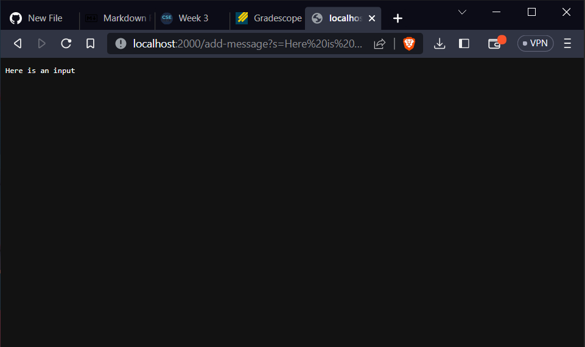
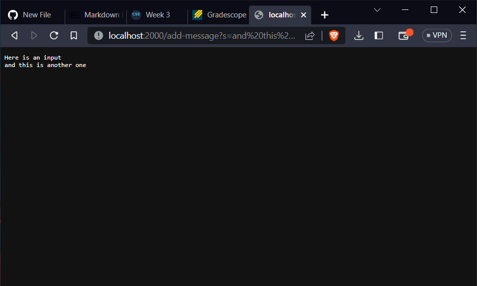
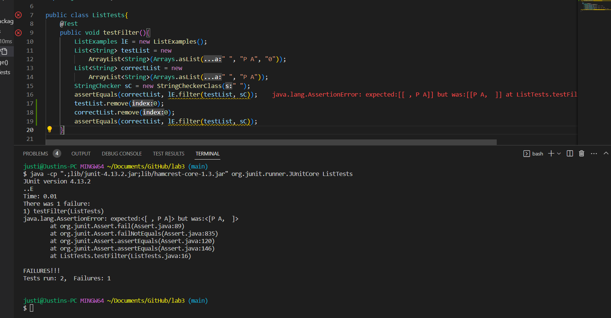
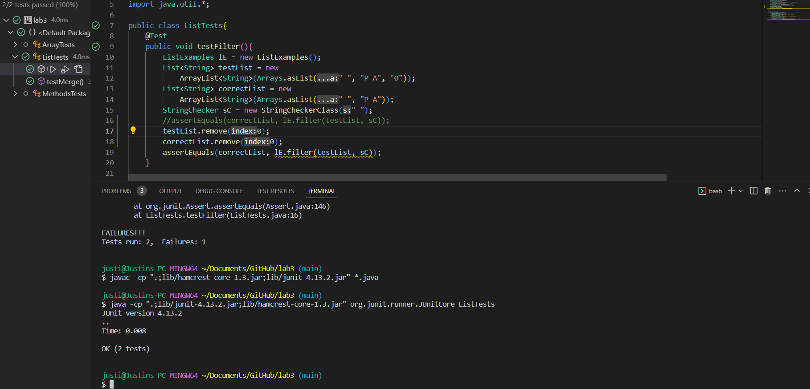

# Part 1
## StringServer Code

    import java.io.IOException;
    import java.net.URI;
    class StringHandler implements URLHandler{
        //The stored message that will be printed on the website
        String message = "";
    
        public String handleRequest(URI url) {
            if (url.getPath().equals("/"))
                return message;
            else {
                if (url.getPath().contains("/add-message")) {
                   String[] parameters = url.getQuery().split("=");
                   if (parameters[0].equals("s")) {
                        message += parameters[1] + "\n";
                        return message;
                    }
                }
               return "404 Not Found!";
            }
        }
    }

    class StringServer {
        public static void main(String[] args) throws IOException {
            if(args.length == 0){
               System.out.println("Missing port number! Try any number between 1024 to 49151");
               return;
           }

           int port = Integer.parseInt(args[0]);

           Server.start(port, new StringHandler());
        }
    }
## First /add-message input

**Relevant Methods and Values**
    
    handleRequest(URI url)
    
url: localhost:2000/add-message?s=Here is an input

    getPath()
    
Returns: /add-message

    getQuery()
    
Returns: ?s=Here is an input

    split()

Input: "="
parameters: ["s", "Here is an input"]
Returns: Array of strings that are split between "="

    equals()
    
Returns: message if the path of url is empty. Also used to check if the query before the equals sign equals "s"

    contains()

Returns: true if the path equated to "/add-message"

In terms of changing values, message will be changing throughout the call since it is instantiated as an empty string initially, then changed to "Here is an input" which would be returned by the method in the end.

## Second /add-message input

**Relevant Methods and Values**

    handleRequest(URI url)
    
url: localhost:2000/add-message?s=and this is another one

    getPath()
    
Returns: /add-message

    getQuery()
    
Returns: ?s=and this is another one

    split()

Input: "="
parameters: ["s", "and this is another one"]
Returns: Array of strings that are split between "="

    equals()
    
Returns: message if the path of url is empty. Also used to check if the query before the equals sign equals "s"

    contains()

Returns: true if the path equated to "/add-message"

In terms of changing values, message will be changing throughout the call since it is instantiated as an empty string initially, then changed to "and this is another one" which would be returned by the method in the end.
# Part 2
Here I will be using the filer() method as my example.

Note: We defined StringChecker to determine if the given string contains the string input into string checker. If it does, it stays in the list. If it does not, it will be removed.

The first assertEquals() method is the test with the failure inducing input. It is supposed to return { "P A" , " " } but instead returns { " " , "P A" }.

The second assertEquals() method is the test with the positive test result. It correctly returns { "P A" }.

    public void testFilter(){
        ListExamples lE = new ListExamples();
        List<String> testList = new
            ArrayList<String>(Arrays.asList(" ", "P A", "0"));
        List<String> correctList = new
            ArrayList<String>(Arrays.asList(" ", "P A"));
        StringChecker sC = new StringCheckerClass(" ");
        assertEquals(correctList, lE.filter(testList, sC));
        testList.remove(0);
        correctList.remove(0);
        assertEquals(correctList, lE.filter(testList, sC));
    }

Failed Test:

Successful Test (Commented out the failing test):

Before:

    static List<String> filter(List<String> list, StringChecker sc) {
        List<String> result = new ArrayList<>();
        for(String s: list) {
            if(sc.checkString(s)) {
                result.add(0, s);
            }
        }
        return result;
    }
    
After:

    static List<String> filter(List<String> list, StringChecker sc) {
        List<String> result = new ArrayList<>();
        for(String s: list) {
            if(sc.checkString(s)) {
                result.add(s);
            }
        }
        return result;
    }
Line 5 was the only problem that this code had since calling add(0, s) would always prepend a value to the list. However what is desired is the original order of the list, hence the use of add(s) on its own.
# Part 3
Overall, I was completely unaware of the capabilities java had in terms of website creation. I have always assumed that there was much more when it comes to creating my own personalized website that could continuously keep track of data. I have leanred more not only about the possibilities of java, but I have also learned how to take advantage of GitHub's Desktop feature which feels extremely useful for large group projects. Before this class, I had a minimal grasp on what GitHub could do. Now I am full understanding just how important this tool is for future careers in my field.
