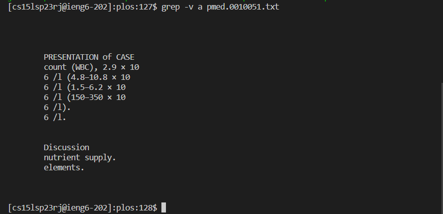
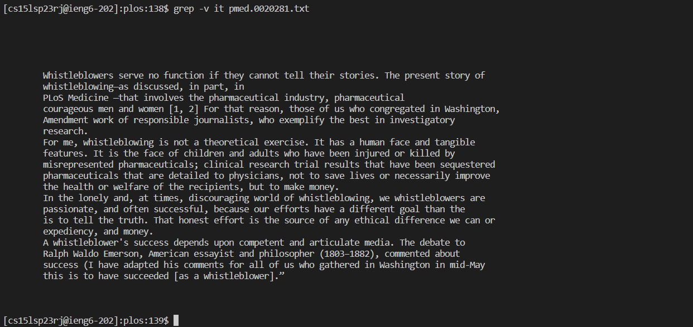
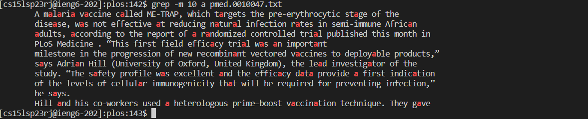
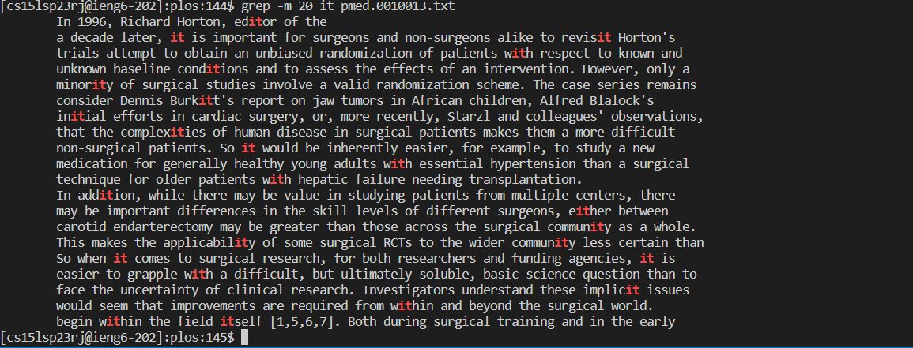
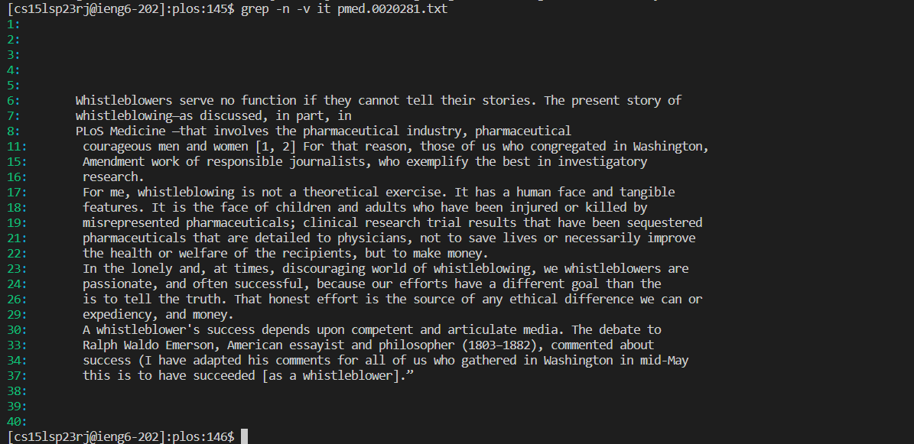
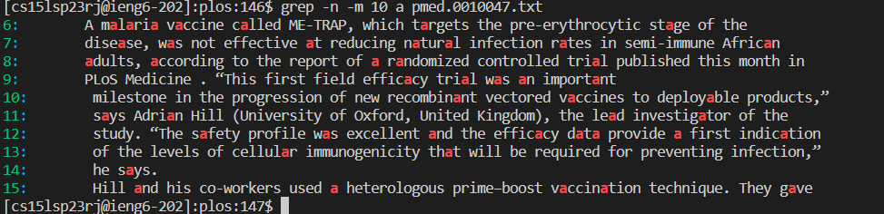
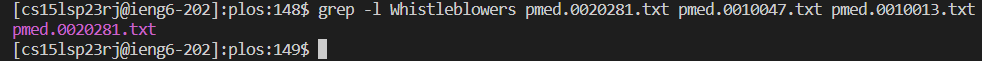
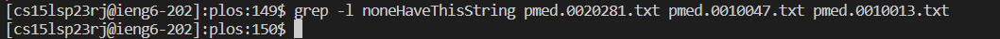

All assisted by the `grep --help` command in the terminal

# Grep -v

    grep -v [What to exclude] [files]

This command for is meant to take the input by the user and find all lines within the file that do not match with it. Those lines are what would be output into the terminal.

## Showcase

# Grep -m

    grep -m [number of desired matches] [string to match] [files]
    
Stops displaying lines that match after the number of lines given reaches the input. If it does not reach the number, it will just print all matching lines.

## Showcase

# Grep -n

    grep -n [string to match] [files]

Displays the line numbers of each output's original line location from the file. It can be useful when trying to reference back to the text to search for the output.

## Showcase

# Grep -l

    grep -l [string to match] [files]

This will output all files that contain the given string. There will be no output however if none of the files contain the string. This is very useful for quick searches between files.

## Showcase

