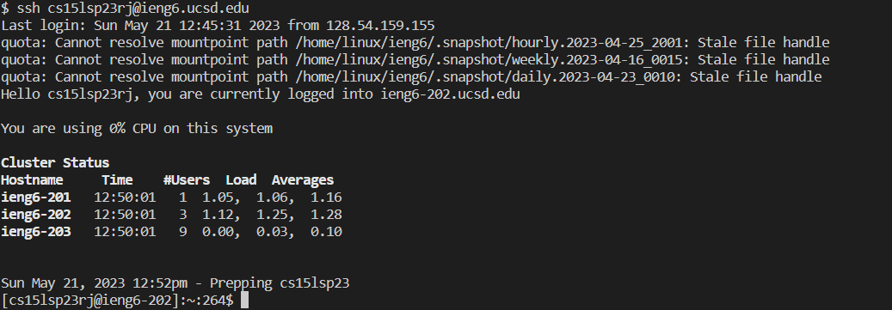
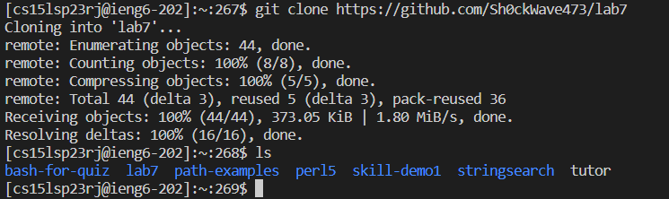
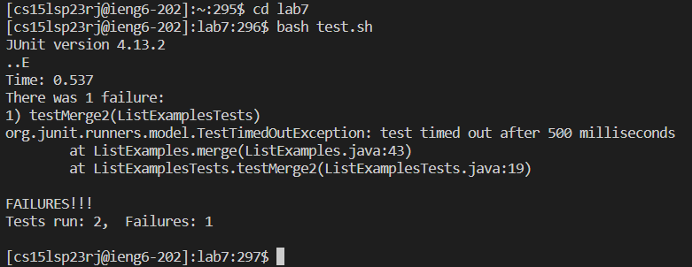
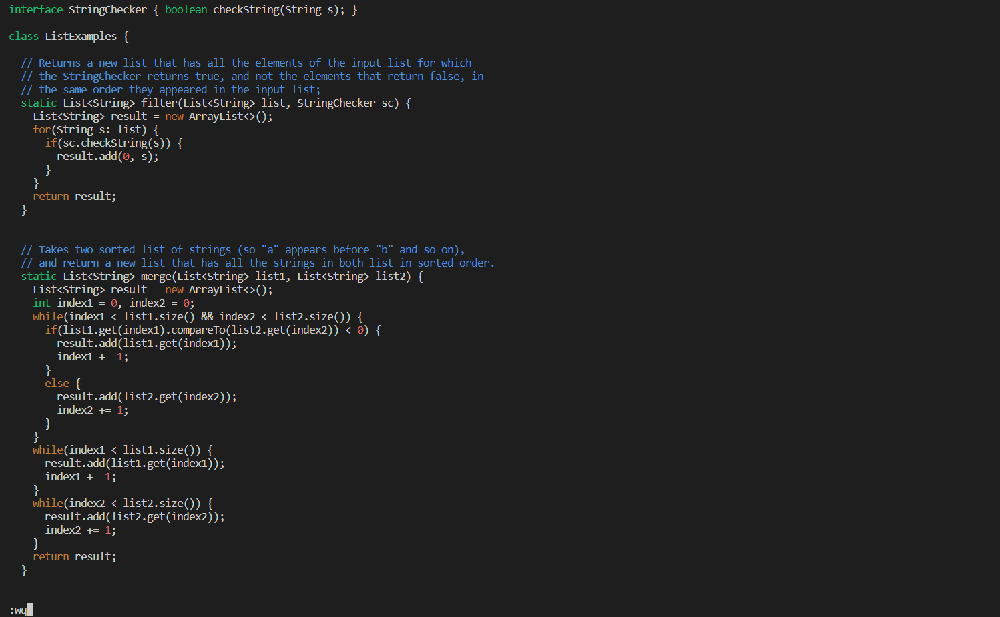
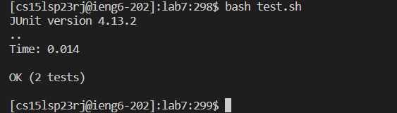
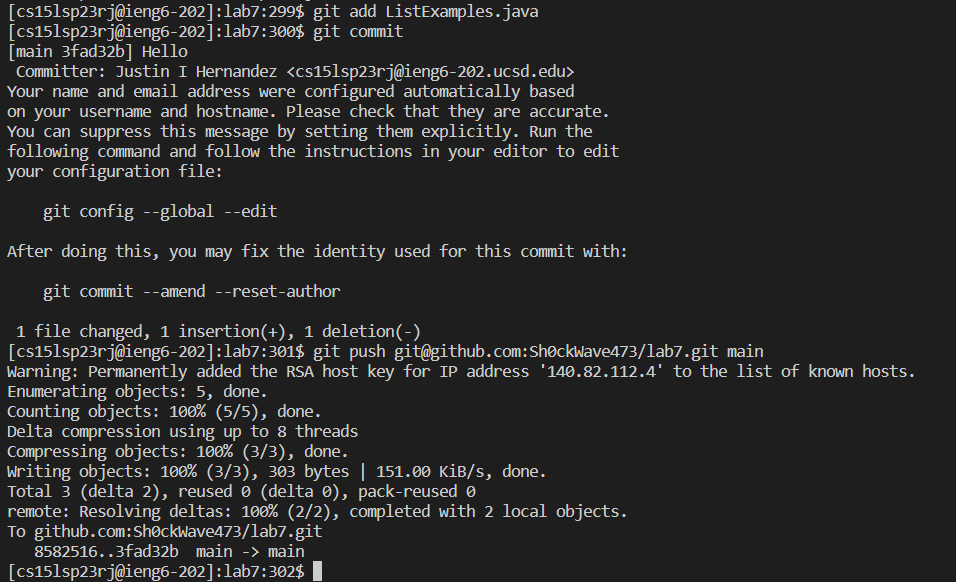

# Completing the 9 steps Given in Lab

## Steps 1-3

Make sure to follow the lab instructions [here]([https://ucsd-cse15l-s23.github.io/week/week7/#baseline](https://ucsd-cse15l-s23.github.io/week/week7/#speeding-up-command-line-tasks)) so that your machine is set up correctly for the next steps ahead.
## Step 4

    ssh<SPACE>cs15lsp23__@ieng6.ucsd.edu<ENTER>

The `__` left in the code is meant to be a placeholder for your account's speciallized characters.

    
## Step 5

    git<SPACE>clone<SPACE><CTRL+V><ENTER>
    ls<ENTER>
    
The `ls` is not necessary, but is helpful to make sure that the command prior worked correctly. Also, what is pasted in is the url of your forked repository found on your GitHub profile when in the repository main page. You can easily copy this from the search bar.

## Step 6

    cd<SPACE>l<TAB><ENTER>
    bash<SPACE>t<TAB>
    
The resulting errors that follow are fine because the file has a bug in it which will be altered.

## Step 7
    
    vim<SPACE>L<TAB>.<TAB><ENTER>
    /1<ENTER>17nr2:wq<ENTER>
    
This is when `vim` is being used to alter the java file from the terminal. Here the `/` command is being used to find any 1's in the file. `17n` is used to get to the 17th 1 in the file, `r2` is used to replace the character at the cursor with a 2, and `:wq` is to save and quit `vim`.

## Step 8
    
    bash<SPACE>t<TAB>
    
If the change was correctly made, this should result in correct tests.

    
## Step 9

    git<SPACE>add<SPACE>L<TAB>.j<TAB><ENTER>
    git<SPACE>com<TAB>
    i<TYPE_ANY_SHORT_MESSAGE><ESC>:wq<ENTER>
    git<SPACE>push<SPACE><CTRL+V><SPACE>main<ENTER>
    
`git add` is used to add the changed file into the list of items to commit. `git commit` will commit any files added before the last commit. After commiting, you are prompted to enter a commit message which can be done by typing `i` and any message you want. Afterwards, you use `<ESC>:wq` to escape to Normal mode, save and quit. `git push` takes a url as the first command and the main branch as its second. The first command will be found by going to your forked repository on the GitHub website, clicking the `<>CODE` dropdown, clicking the `SSH` tab, and copying the ssh key which is used to paste into the terminal.

