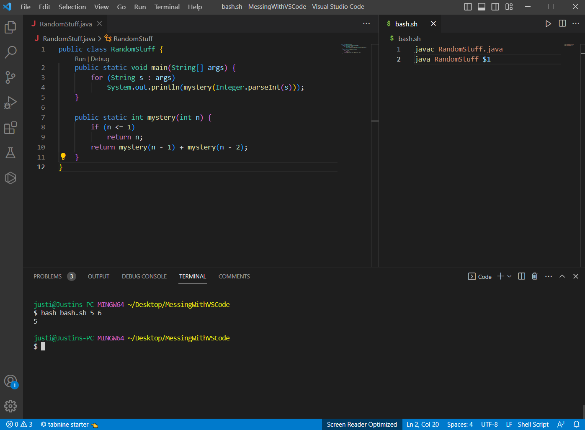
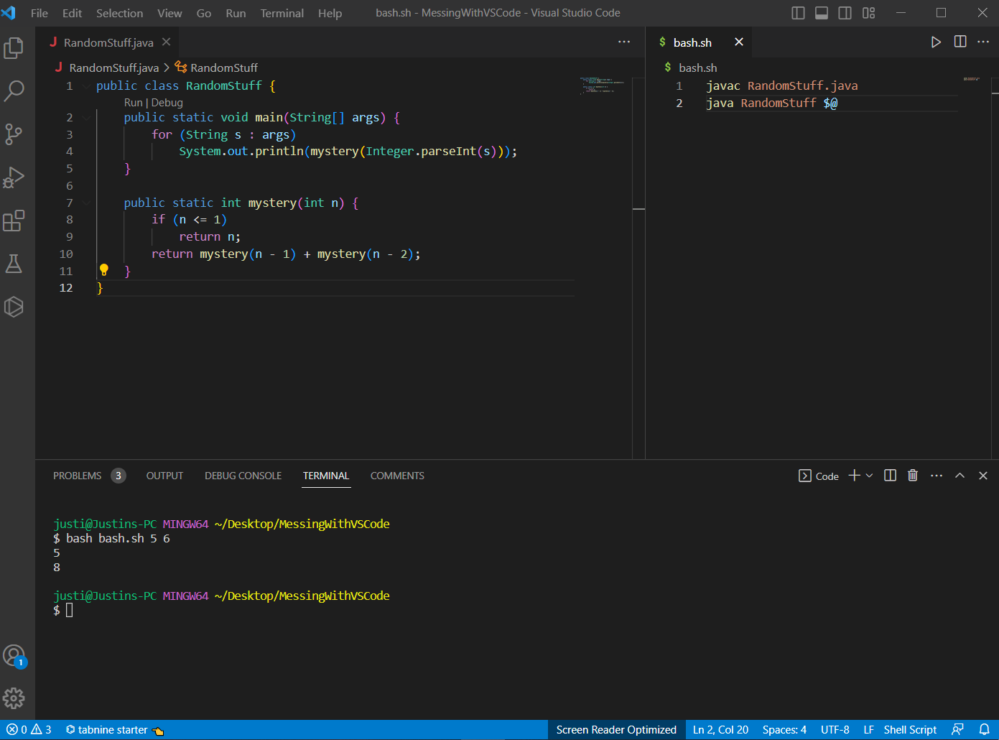

# Student's Original Post
**What environment are you using (computer, operating system, web browser, terminal/editor, and so on)?**

I am using VSCode on a Windows computer.

**Detail the symptom you're seeing. Be specific; include both what you're seeing and what you expected to see instead. Screenshots are great, copy-pasted terminal output is also great. Avoid saying “it doesn't work”.**

It seems like the symptom for my program is that I am not getting enough results from my output. What I am trying to get output is all of the fibonacci values at the specified indices that are provided in order. But I only get one instead.

**Detail the failure-inducing input and context. That might mean any or all of the command you're running, a test case, command-line arguments, working directory, even the last few commands you ran. Do your best to provide as much context as you can.**

The failure inducing input is when I input `bash bash.sh 5 6` into the terminal. I am in the correct working directory since the code seemed to have run fine for the first number. That might mean there is something incorrect in my main method or my bash script because the mystery method is outputing correct values.

# TA's Response To The Post
When taking a look at your bash file, `$1` is meant to be taking in the first input after `bash.sh`. What is going to happen to the other inputs afterwards? Maybe look into what `$@` does for bash.

# Fixed Code

The bug in the code was located in the bash script where it originally used `java RandomStuff $1`. In this case, the code was only taking in the first value instead of reading all of the arguments passed to the bash script. That is why the `$1` changed to a `$@` so all inputs could be accounted for.

# Information Need To Help The Student
**The file & directory structure needed**

-MessingWithVSCode

----bash.sh
  
----RandomStuff.java
  
  
**The contents of each file before fixing the bug**

  This is already provided in the Student's Original Post section.
  
**The full command line (or lines) you ran to trigger the bug**

  This is already provided in the Student's Original Post section.
  
**A description of what to edit to fix the bug**

  This is already provided in the Fixed Code section.
  
# Reflection
One of the tools that I will definitely take out of this second half of the quarter is Vim since it a very important tool for my future aspirations in a Computer Science career. I had no clue this even existed and now I have a firm grasp on the basics of its functionalities which I will continue to develop in the future. Thanks to the lab, I also know there is a built in `vimtutor` command that can serve as a guide whenever I need a refresher on some commands.
